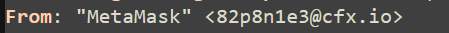
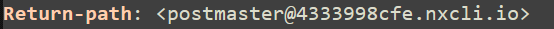
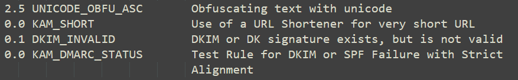
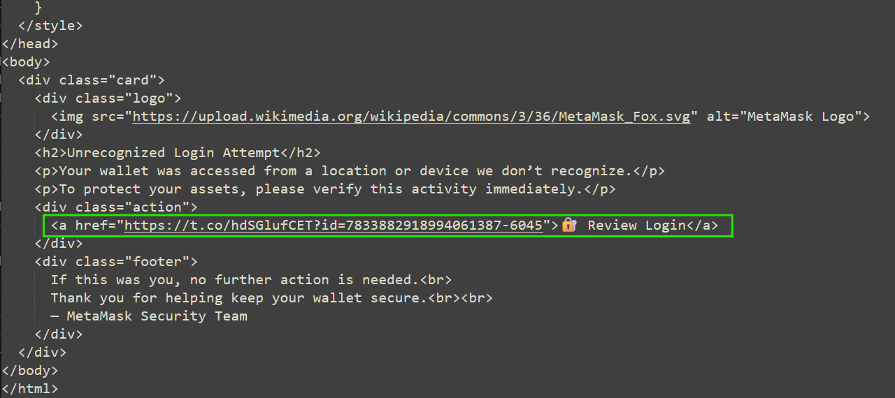
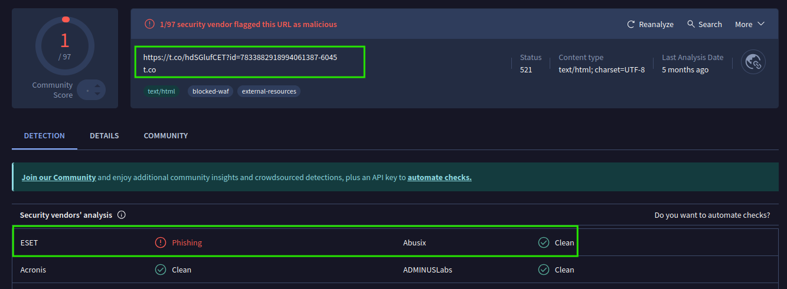
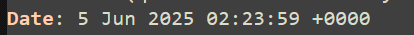
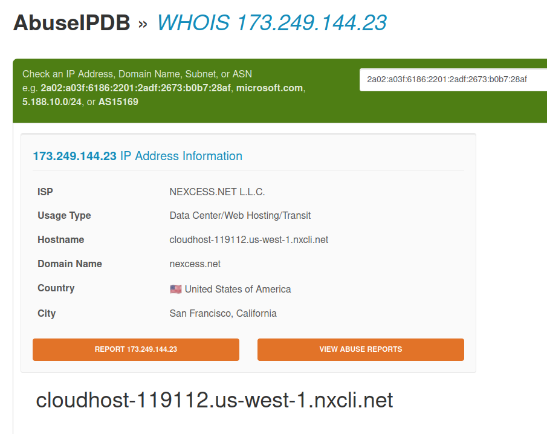
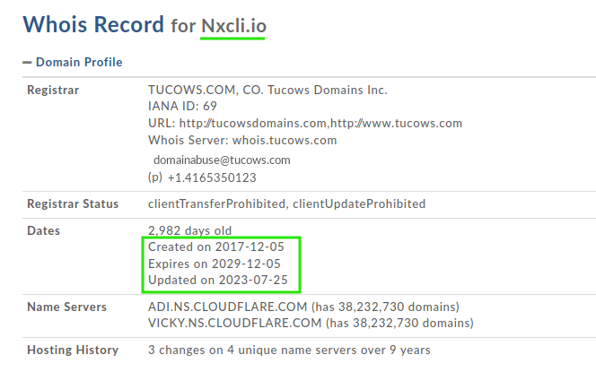
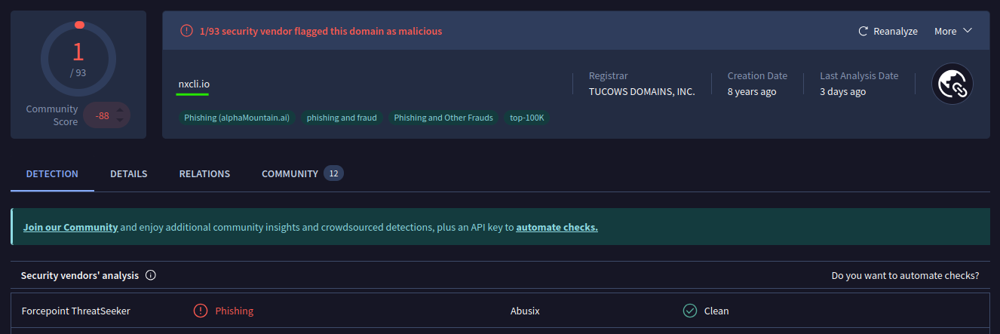

# MetaMask phishing analysis

**Severity:** HIGH

**Incident ID:** 671-METAMASK

**Analyst:** SancLogic

**Date:** 5 June 2025

---

## Executive Summary

A phishing email impersonating MetaMask targeted a business inbox, warning of an "unrecognized login attempt" and urging the user to click a link to verify activity. The email used Unicode homoglyph obfuscation and a URL shortener, typical techniques to bypass detection. Clicking the link could lead to wallet credential theft.

---

## WHO

- **Attacker**: Unknown (impersonating MetaMask)
- **Victim**: Business inbox
- **Brand impersonated**: MetaMask

---

## WHAT

- HTML phishing email mimicking MetaMask UI
- Obfuscated sender name and subject using Unicode homoglyphs (automatically detected: **SpamAssassin rule UNICODE_OBFU_ASC**)
- Envelope From / Return-Path headers:

```sh
"MetaMаsk" <82p8n1e3@cfx.io>
Domain: 4333998cfe.nxcli.io
```

- Link to shortened URL (`t.co`) leading to credential-stealing site











---

## WHEN

- **Email received**: 5 June 2025, 02:23:59 UTC



---

## WHERE

- **Sender IP**: 173.249.144.23 (cloudhost-119112.us-west-1.nxcli.net)
- **From domain**: 4333998cfe.nxcli.io
- **Link redirect**: [t.co](hxxps://t.co/) shortener -> external phishing site







---

## WHY 

- **Technical**:
  - Unicode obfuscation used to bypass email security filters
  - URL shortener concealed the final phishing destination
  - Use of .io TLD to increase perceived legitimacy

- **Human**:
  - Urgent security alert ("unrecognized login attempt")
  - Exploits fear of cryptocurrency wallet compromise

---

## HOW

- Sent HTML email mimicking MetaMask UI
- User prompted to click "Review Login" link
- URL redirects to credential-stealing site
- Spam analysis detected Unicode obfuscation, URL shortener, and DKIM/DMARC anomalies

---

## Indicators of Compromise (IOCs)

- **From email**: `82p8n1e3@cfx.io`
- **From domain**: `4333998cfe.nxcli.io`
- **Sender IP**: `173.249.144.23`
- **Link**: `hxxps://t[.]co/hdSGlufCET?id=7833882918994061387-6045`
- **Subject**: MetаMаsk Ѕесurіtу Аlеrt - Unrecognized Lоgіn Attempt
- **Spam traits**: Unicode obfuscation, HTML only, Pyzor listed

---

## MITRE ATT&CK Mapping

- T1566.001 - Phishing: Spearphishing via Email
- T1204.002 - User Execution: Malicious Link
- T1566.002 - Phishing: Link in Email

---

## Impact

- High-risk credential theft attempt targeting cryptocurrency assets
- Successful interaction could lead to direct financial loss through wallet compromise

---

## Recommendations

- Block sender domain and originating IP
- Implement email filtering rules to flag messages with non-Latin Unicode characters in display name or subject if the sending domain isn't the official brand
- Detect shortened URLs combined with financial or security-themed urgency
- Educate users about crypto-related phishing and fake security alerts
- Enforce strong authentication and wallet security best practices

